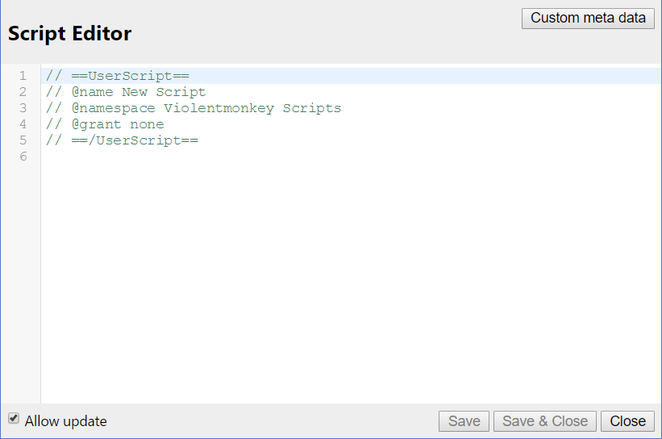
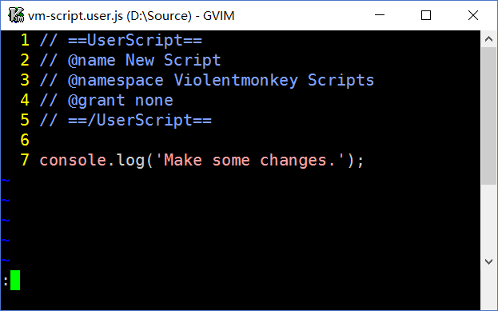
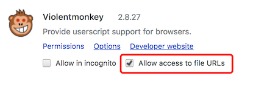
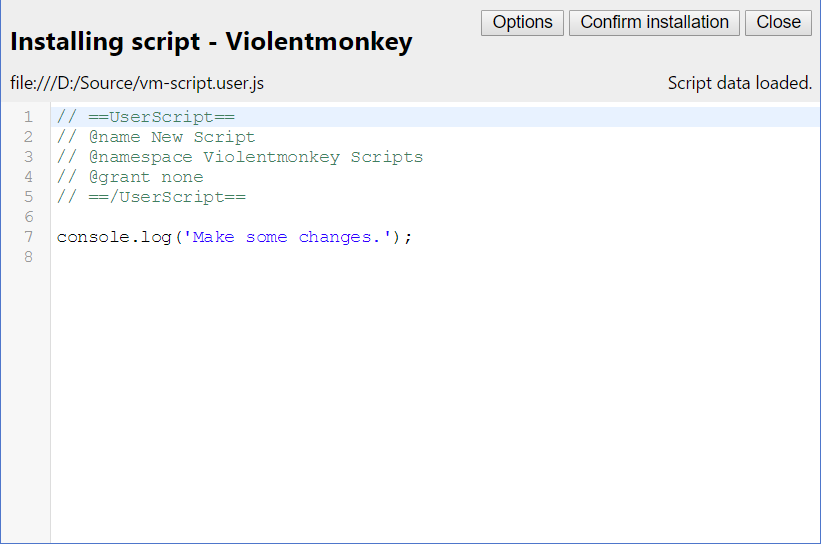
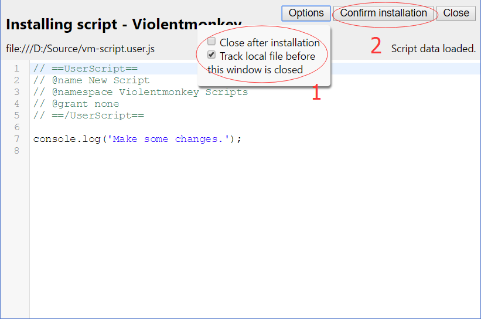
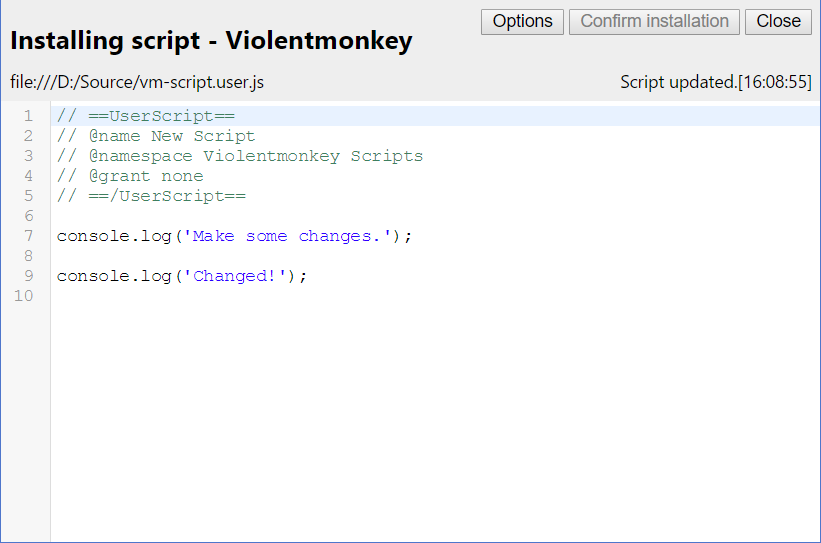

For anyone who uses Violentmonkey, it is easy to find a way to edit a script like this:

However, it is really hard to make everyone love it. *A* probably likes a theme of `monokai`, while *B* prefers `eclipse`. *C* might use 2 spaces for indentation while *D* prefers tabs.

It is impossible to satisfy every single user. Lots of configurations may be added for this, but are they really worth it? A user would have to face lots of choices before he could use it just as a script manager, or have to look for a simple option among lots of unrelated editor options. What is worse, the browser may inhibit some shortcuts or operations that a local editor can have. In other words, an editor inside Violentmonkey will never be as good as your favorite one.

Here comes the question: How to edit my script with my favorite editor?

Save to a file
---

First, copy the script to your favorite editor and save it to a file.

VIM is my favorite editor, and the script is saved at `D:/Source/vm-script.user.js`. Note that the script file must have a name ending with `.user.js`, otherwise won't be recognized by Violentmonkey.

Install a local script
---

First make sure the local script is named with a suffix of `.user.js`.

There are two ways to install a local script:

- *Easy way:* drag the file into the browser.

  It will be recognized by Violentmonkey and loaded in the confirmation page.

  Make sure *"Allow access to file URLs"* is checked in your *Chrome extension settings* (`chrome://extensions`).
  
  
  
  **Note** that due to a [known issue](#known-issues), the *easy way* **won't work for Firefox users**.

- *Hard way:* start a local HTTP server, then open the local script with a URL like `http://localhost:8080/my-script.user.js`.

  One of the best way is to use node/npm's [indexzero/http-server](https://github.com/indexzero/http-server#readme). If you have it installed, just type `http-server -c5` at the directory of your script to start a server.

  Make sure the hostname is `localhost` and the script name ends with `.user.js`.

  **Note** that due to a [known issue](https://github.com/violentmonkey/violentmonkey/issues/460#issuecomment-434335758), the *hard way* needs to handle caching. In `http-server -c5` option `-c5` sets cache time for max-age header to 5 seconds, thus forcing a browser to query the server URL every 5 seconds. The caching can be disabled with `-c-1` option.

Make sure the `track local file` option is checked and then confirm installation.

Edit and sync
---

After installation, the confirmation page will keep watching the file before the page is closed. Once the file is changed, the new version will be installed automatically. As a result, you edit the script in your favorite editor, and the changes are synced to Violentmonkey immediately.

Known issues
---
- In Firefox Violentmonkey is not allowed to access local files, so we have to start a local HTTP server for tracking. See [this on bugzilla](https://bugzilla.mozilla.org/show_bug.cgi?id=1266960).
- The older the file is, the more seldom a browser will query it. See [this Violentmonkey's issue](https://github.com/violentmonkey/violentmonkey/issues/460#issuecomment-434335758).
